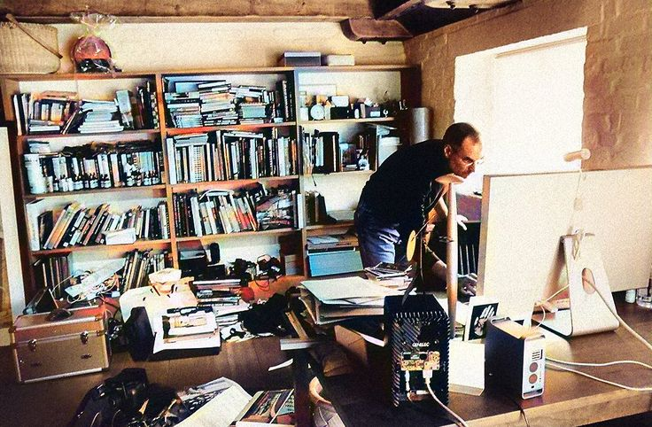

Los científicos también pueden ser humanistas. Los humanistas también pueden ser científicos.

La intersección de las ciencias y el humanismo logra cosas impresionantes.

En [Steve Job - Walter Isaacson](Libros/Steve%20Job%20-%20Walter%20Isaacson.md), Jobs dice:

> "Comence a escuchar mas musica y empeze a leer mas cosas que no tuvieran que ver con la ciencia o la tecnologia (Shakespeare, Platon). Me encantaba el Rey Lear.... Otras obras favoritas eran Moby Dick y los poemas de Dylan Thomas. ..."
> 

> Ese era otro ejemplo más de cómo Jobs se situaba conscientemente en la intersección entre el arte y la tecnología. En todos sus productos, la tecnología iba unida a un gran diseño, una imagen, unas sensaciones, una elegancia, unos toques humanos e incluso algo de poesía. Fue uno de los primeros en promover interfaces gráficas de usuario sencillas de utilizar. En ese sentido, el curso de caligrafía resultó ser icónico. «De no haber asistido a esa clase de la universidad, el sistema operativo Mac nunca habría tenido múltiples tipos de letra o fuentes con espaciado proporcional. Y como Windows se limitó a copiar el Mac, es probable que ningún ordenador personal los tuviera». (Isaacson, 2011, p.69)

*En progreso*

[^1]: El Capitán Ahab estaba obsesionado con cazar a Moby Dick,  que murió atado en su barco.